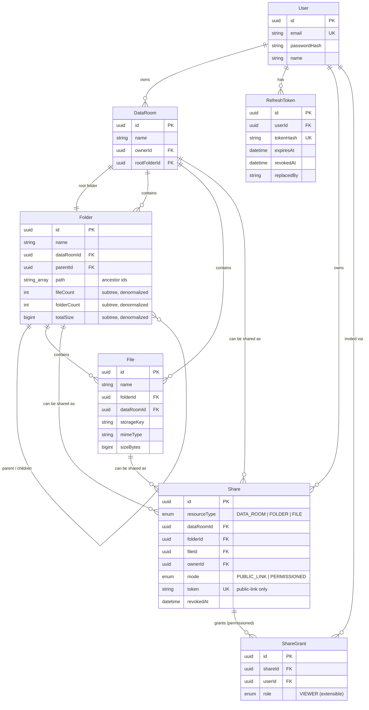

# Data Room

A secure virtual data room for due-diligence document sharing — nested folders, PDF upload with per-file progress, and granular sharing (public link or per-user invite) with read-only enforcement.

**Live app:** https://data-room-smoky.vercel.app
**API:** https://data-room-backend.onrender.com/api

> The backend is on Render's free tier, which spins down after ~15 minutes of inactivity. The first request after a period of idleness can take 30–50s to wake up — subsequent requests are fast. This is a hosting-tier limitation, not an application bug.

## Stack

| | |
|---|---|
| Frontend | Next.js 16 (App Router) · TypeScript · Tailwind · shadcn/ui · TanStack Query · Zustand |
| Backend | NestJS · Prisma · PostgreSQL (Supabase) |
| File storage | Supabase Storage (private bucket, signed URLs) |
| Auth | Email/password · JWT access token (15 min) + rotating refresh token (14 days) |
| Hosting | Vercel (frontend) · Render (backend) · Supabase (DB + Storage) |

## Design decisions

**Data Room = a Folder tree with an implicit root.** Every `DataRoom` owns exactly one root `Folder` (`parentId = null`). Files and folders never need special-cased "am I at the room root?" logic anywhere in the app — a Data Room's contents are just "the subtree under its root folder." The only awkward part is bootstrapping: a `DataRoom` and its root `Folder` reference each other, so `DataRoom.rootFolderId` is nullable and set in a second step inside the same transaction that creates both rows (see `DataRoomsService.create`).

**Materialized path for ancestry.** Every `Folder` stores `path: string[]` — the list of ancestor folder ids from the room root down to (but excluding) itself. This gives O(1) breadcrumb rendering, cheap "is X an ancestor of Y" checks for share inheritance, and a simple descendant query (`path @> [id]`) for cascade delete — all without recursive CTEs on the request path.

**Denormalized subtree aggregates, updated incrementally.** `Folder.fileCount` / `folderCount` / `totalSize` cover the whole subtree and are maintained by walking the ancestor chain (`path`) and applying a `±delta` inside the same transaction as the create/move/delete — see [How it scales](#how-it-scales) below for the reasoning.

**Auth: rotating refresh tokens, not a session store.** Access tokens are short-lived JWTs (15 min) kept in memory on the client (never localStorage — an XSS payload shouldn't be able to read it). Refresh tokens live 14 days as an httpOnly, `Secure`, `SameSite=None` cookie (frontend and backend are different origins), and are **rotated** on every use: each refresh issues a new pair and revokes the old token. If a revoked token is ever replayed (a strong signal of theft), every active session for that user is revoked immediately. Only the token's SHA-256 hash is stored in `RefreshToken`, never the raw value.

**Sharing is its own model, not a permission bit on the resource.** A `Share` points at exactly one of `dataRoomId` / `folderId` / `fileId` and has a `mode` (`PUBLIC_LINK` or `PERMISSIONED`). Permissioned shares fan out to individual `ShareGrant` rows (one per invited user), each carrying a `role` (currently only `VIEWER`). Read access to any resource is resolved by `PermissionsService`: owner, OR an active share on the resource itself, OR an active share on any ancestor folder / the data room (checked via the materialized `path`). A public-link share additionally allows fully anonymous access through a separate, token-gated set of endpoints (`/shares/public/:token/...`) that never touch the authenticated-user code path.

**One file, one URL.** Every file — whether reached by browsing your own room, a shared folder, or a link straight to a single shared file — renders at the same dedicated page (`/rooms/:roomId/files/:fileId`, or the public equivalent). Earlier this was a modal opened from inside the folder browser, which meant a file reached via a file-only share (no folder access) had nowhere to open into. Unifying on one page per file fixed that and removed the duplicate rendering path.

**Frontend nav reflects access, not the URL prefix.** `/rooms/:roomId/...` is used both for rooms you own and rooms you can only see via a share, so the "My Data Rooms" vs. "Shared with me" highlight can't be derived from the path alone. Folder and file pages read the `canWrite` flag the backend already computed for that request (owner check) and report it into a small section store that the nav bar reads — so the correct tab stays highlighted no matter how you navigated there, including on a hard refresh.

**Edge cases handled explicitly:**
- Uploading/renaming to a name that already exists in the folder → auto-suffixed (`file (1).pdf`), never a hard error.
- Deleting a folder shows a preview (`X folders, Y files, Z size`) before confirming, using the same denormalized aggregates.
- A folder/file that's been deleted or unshared out from under a viewer resolves to a clear "no longer available" state instead of a crash.
- Moving a folder into itself or one of its own descendants is rejected server-side.
- Revoking a share (public link or a specific user's grant) takes effect on the next request — verified end-to-end in this repo's manual test passes.

## Project structure

```
data-room/
  backend/     NestJS API (Prisma schema in backend/prisma/schema.prisma)
  frontend/    Next.js app
  render.yaml  Render Blueprint for the backend
```

## Data model / ERD



## How it scales

**How do you compute the total size and item count of a folder including its whole subtree?**
Not with a recursive query on every read. `Folder.fileCount`, `folderCount`, and `totalSize` are denormalized columns covering the entire subtree, updated **incrementally** whenever something changes: on file upload/delete/move and folder create/delete/move, the service walks the ancestor chain (`Folder.path`, already materialized — no recursive lookup needed) and applies a `±delta` to every ancestor in the same DB transaction as the mutation. A folder view is then a single-row read (O(1)), and a mutation costs O(depth), never O(subtree size). A recursive CTE is still the right tool for a one-off backfill or an integrity audit, just not for the hot path.

**What changes when one Data Room holds 100,000 files?**
- **Listing**: `Folder.getChildren` already uses **keyset pagination** on files (`WHERE (name, id) > (cursor)`, ordered by `name, id`, default page size 50) instead of `OFFSET`, so page N is exactly as cheap as page 1 — no scanning-and-discarding.
- **Indexes**: `File` has `@@index([folderId])` (a folder's own file list) and `@@unique([folderId, name])` (also serves as the index that backs the pagination cursor and the name-conflict check). At 100k+ files, a `pg_trgm` GIN index on `File.name` would be the next step for the extra-credit search feature (substring search instead of a sequential scan).
- **Path/ancestry**: `Folder.path` is a `String[]`; at real scale I'd add a GIN index on it (`@@index([path], type: Gin)`) so "does this share cover folder X" and cascade-delete's descendant lookup (`path has X`) stay index-backed instead of falling back to a sequential scan.
- **Aggregates**: already O(depth) per write regardless of item count (see above), so 100k files doesn't change the cost of *displaying* a size/count — only the one-time cost of the migration that would backfill them if they didn't already exist.

**How does sharing extend to per-user roles (viewer/editor) without remodeling?**
`ShareGrant.role` is already an enum column (`VIEWER` today). Adding `EDITOR` is an enum extension, not a schema change: `ShareRole { VIEWER EDITOR }`. The only other change is in `PermissionsService` — write checks currently require `resource.ownerId === userId`; they'd become `owner OR (an active grant with role = EDITOR covering this resource or an ancestor)`, mirroring the read-check logic that already walks `Share`/`ShareGrant` through the materialized path. No table is added, renamed, or restructured.

## Setup

### Prerequisites
- Node.js 22+
- A [Supabase](https://supabase.com) project (Postgres + Storage) — the free tier is enough

### 1. Supabase
1. Create a project, then **Connect → ORMs → Prisma** to get `DATABASE_URL` / `DIRECT_URL`.
2. Grab `SUPABASE_URL` and the **secret** key (`sb_secret_...`, not the publishable/anon one) from Project Settings → API.
3. Create a **private** Storage bucket (any name — used as `SUPABASE_STORAGE_BUCKET`).

### 2. Backend
```bash
cd backend
npm install
cp .env.example .env   # fill in the Supabase values above + generate two random JWT secrets
npx prisma migrate deploy
npm run start:dev       # http://localhost:4000/api
```

### 3. Frontend
```bash
cd frontend
npm install
cp .env.example .env.local   # NEXT_PUBLIC_API_URL=http://localhost:4000/api
npm run dev                   # http://localhost:3000
```

### Deployment
- **Backend → Render**: this repo includes `render.yaml` (a Render Blueprint). New → Blueprint → point at the repo → fill in the Supabase-derived env vars (marked `sync: false`) → deploy. JWT secrets are auto-generated by the blueprint.
- **Frontend → Vercel**: New Project → import the repo → set **Root Directory to `frontend`** (this is a two-app repo, not a single Next.js root) → add `NEXT_PUBLIC_API_URL=<render-backend-url>/api` → deploy.
- After both are up, set the backend's `CORS_ORIGIN` env var to the Vercel URL (cross-origin cookies require an exact origin match, not a wildcard).

## Extra credit

Not implemented — the brief asked to time-box and only attempt these if time remained after the core requirements; core scope (including the sharing edge cases and the fixes found during manual QA) filled the available time.
- Search/filtering by file name
- File versioning on name conflicts (current behavior: auto-suffix, no version history)

## Where AI was used

This project was built with Claude (Sonnet 5, via Claude Code) doing essentially all of the implementation — schema design, backend modules, frontend components, and deployment configuration — from an initial technical plan agreed with the requester before writing code (data model, sharing model, auth strategy, and the three "how it scales" answers were decided upfront, not discovered ad hoc).

Beyond initial generation, AI was used for:
- **Live verification, not just code generation.** Every feature (auth rotation/theft-detection, cascade delete with aggregate rebalancing, conflict-safe rename, public/permissioned sharing, read-only UI enforcement) was exercised against the real Supabase-backed dev server via `curl` and against a real browser via Playwright — including multi-context scenarios (owner + invitee + anonymous visitor) — rather than assumed correct from reading the code.
- **Bug-finding through actual usage**, not just review: browser testing surfaced a wrong font-variable binding, invalid nested HTML in the breadcrumb component, a read-only user still seeing owner-only controls, a file shared without its folder being unreachable, and a nav highlight that didn't reflect which section a shared resource belonged to. Each was root-caused and fixed, then re-verified with a fresh Playwright pass.
- **Deployment troubleshooting**: diagnosing a Prisma "invalid connection string" error (stray characters from a copy-paste) and a Render build failure (`NODE_ENV=production` causing `npm install` to skip `devDependencies`, where the Nest CLI lives) from pasted dashboard logs.

All product and architecture decisions — tech stack, auth model, sharing model, when to unify vs. keep separate, what counts as in-scope for a take-home — were made by the requester; AI proposed options and trade-offs where a decision was needed and implemented the result.